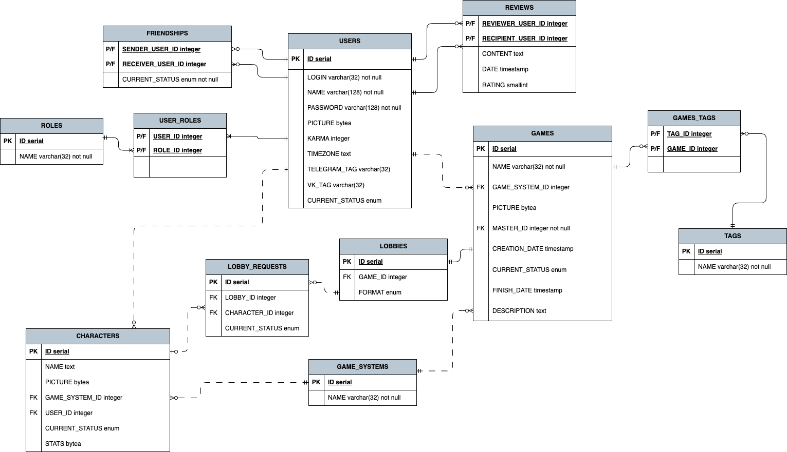

# Рефакторинг приложения

## Описание существующего приложения

### Общая информация

- [Техническое задание](pdf/term-paper-requirements.pdf)
- Команда
  - Тучков Максим Русланович
  - Кондратьева Ксения Михайловна
- Группа
  - P34121

### Предметная область

Система управления данными и взаимодействием между пользователями ролевых настольных игр

#### Подробное описание предметной области

Система представляет собой пространство, в котором пользователи могут взаимодействовать в контексте ролевых настольных игр (например, “Dungeon & dragons”, “Pathfinder”).
Каждый пользователь может стать игроком или мастером, и, в зависимости от выбранной роли, получить ряд возможностей.
Мастер: создаёт и ведёт сюжеты, определяет необходимые для участия в сюжете критерии (например, вселенную игры, часовой пояс, формат общения, время приема заявок и т.д.), объявляет о наборе игроков (лобби). Сюжет – это связующее звено между мастером и игроками, которое может иметь теги, краткое описание и тд. для удобства поиска.
Пользователь-игрок имеет возможность отправить заявку на участие в конкретном сюжете. Это делается посредством выбора одного из своих свободных персонажей, соответствующих вселенной игры.
Мастер рассматривает заявки и, в случае успешного подбора, объявляет о начале игры. После этого все пользователи-участники получают уведомление, списываются в стороннем мессенджере и идут играть в настольную / виртуальную игру.
По завершении игры мастер меняет ее статус на “завершенная”, и игрокам дается возможность оставить отзыв о мастере, поставить положительную/отрицательную оценку другим игрокам. Также мастер может перевести игру в состояние “прерванная”, и тогда возможность изменить карму других пользователей пропадает.
Для большего удобства система предполагает поиск по пользователям (чтобы добавить в друзья), вселенным игр, сюжетам и таблицу рейтинга.
Система также предполагает наличие администратора.

Таким образом, профиль пользователя включает в себя следующую информацию:

- Общая информация (например, имя, часовой пояс и т.д.)
- Ссылки на мессенджеры 
- Друзья 
- Карма (которая вычисляется из оценок других пользователей)

Если пользователь игрок:

- Созданные персонажи (с их общими характеристиками: имя, вселенная игры, класс, раса, привязка к конкретному сюжету и тд.)

Если пользователь мастер:

- Созданные сюжеты 
- Отзывы прочих игроков о качестве проведения игр

Сюжет же может включать в себя следующее:

- Название
- Вселенная игры
- Картинка-ассоциация
- Краткое описание
- Мастер
- Список заявок / утвержденных игроков
- Тэги (для фильтрации)

Сценарии использования системы:

Сценарий 1

- Пользователь-игрок выбирает один из предложенных сюжетов, создает персонажа, если у него отсутствует нужный, и подает заявку на участие посредством отправки анкеты персонажа соответствующей вселенной игры.
- Пользователь-игрок ожидает уведомления о принятии заявки пользователем-мастером.
- После получения положительного отклика игрок может связаться с мастером  в стороннем мессенджере для уточнения дальнейших действий или ожидать начала игры мастером.
- При отрицательном отклике сценарий повторяется.
- После завершения игры пользователь может оставить отзыв о мастере и поставить положительную или отрицательную оценку другим игрокам для изменения их кармы.

Сценарий 2

- Пользователь-мастер создает сюжет и публикует его
- Мастер ожидает отклика игроков.
- При рассмотрении заявки пользователя-игрока мастер может принять или отклонить ее.
- После сбора команды мастер связывается с игроками в стороннем мессенджере и изменяет статус игры на “В процессе”.
- После окончания игры мастер изменяет ее статус на “Завершенная” и может поставить положительную или отрицательную оценку другим игрокам .
- Мастер может изменить статус игры на “Прервана” и тогда возможность оставить отзыв и оценку пропадает.

### Даталогическая модель



### Backend

Spring boot application stack:

- spring boot web
- spring boot jdbc
- spring security web
- spring security config
- postgresql

Структура приложения

```text
.
├── pom.xml ────────────────────────────────────────────────────────────────> Файл конфигурации проекта
└── src/ ───────────────────────────────────────────────────────────────────> Исходный код проекта
    └── main/
        ├── java/
        │   └── com/
        │       └── manu/
        │           └── roleplaybackend/
        │               ├── RolePlayBackendApplication.java ────────────────> Точка входа
        │               ├── config/ ────────────────────────────────────────> Конфигурационные классы
        │               ├── controllers/ ───────────────────────────────────> Классы rest-контроллеры и перехватчик
        │               ├── db/ ────────────────────────────────────────────> Взаимодействие с базой данных
        │               ├── model/ ─────────────────────────────────────────> Все модели, которыми оперирует приложение
        │               └── services/ ──────────────────────────────────────> Сервисы взаимодействия с базой данных
        └── resources/
            ├── application.properties ─────────────────────────────────────> Статическая конфигурация приложения
            └── sql/ ───────────────────────────────────────────────────────> Файлы пред- и постобработки бд
                ├── create/ ────────────────────────────────────────────────> Файлы создания сущностей в бд
                ├── drop/ ──────────────────────────────────────────────────> Файлы удаления сущностей в бд
                └── insert/ ────────────────────────────────────────────────> Файлы заполнения бд начальными данными
```

### Frontend

React application stack:

- react
- webpack
- tailwind-css
- js 
- npm

Структура приложения

```text
.
├── public/ ─────────────────────> Публичные ресурсы
└── src/ ────────────────────────> Исходный код проекта
    ├── auth/ ───────────────────> Запросы авторизации к backend
    ├── components/ ─────────────> Визуальные компоненты приложения
    ├── index.js ────────────────> Точка входа
    ├── redux/ ──────────────────> Redux-слайсы для работы с состоянием
    ├── router/ ─────────────────> Навигация
    ├── service/ ────────────────> Прочие запросы к backend
    └── util/ ───────────────────> Утилитные функции
```

## Рефакторинг

### Этап 1 (v.1)

Ссылка на отчет (docs.google)

- https://docs.google.com/document/d/1oiNN4O1Gf33xgSukXvaEc-iWNWjXpuuH9RfdXXW0NqI/edit?usp=sharing

Общее

- [x] Декомпозиция кода
- [x] Реструктуризация репозитория
- [x] Применение [соглашения о ветвлении](img/branching.png)

Backend

- [x] OpenAPI спецификация для backend ([Swagger](https://se.ifmo.ru/~s333057/role-play-swagger/))
- [x] Добавление корректного логгирования (sl4j)

Frontend

- [x] Добавить обработку ошибок
- [x] Миграция: webpack -> vite

### Этап 2 (v.2)

Backend

- [x] Добавить поддержку Spring security (вместо костыля-перехватчика запросов)
- [x] Миграция: статический sql -> DTO

Frontend

- [x] Миграция на TypeScript

### Этап 3 (v.3)

Общее

- [ ] Написание unit-тестов
- [ ] Добавить развертывание frontend, backend, и database в контейнерах под управлением k8s
